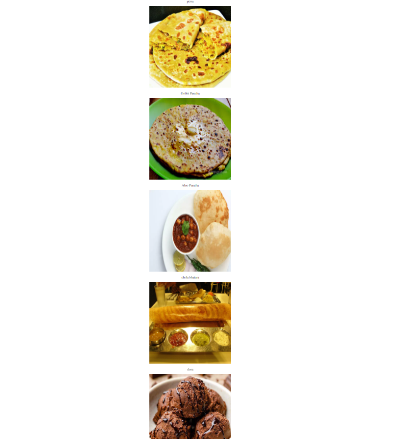

# mini_project._.fav-food
This is a mini project to display some of my favourite food

# Contribution Guidelines
We love your input! We want to make contributing to this project as easy and transparent as possible, whether it's:

- Reporting a bug
- Discussing the current state of the code
- Submitting a fix
- Proposing new features
- Becoming a maintainer

Use a Consistent Coding Style

## To get started with contributions
- Fork the repository to your own Github account
- Clone the project to your machine
- Create a branch locally with a succinct but descriptive name
- Commit changes to the branch
- Following any formatting and testing guidelines specific to this repo
- Push changes to your fork
- Open a PR in our repository and follow the PR template so that we can efficiently review the changes.

